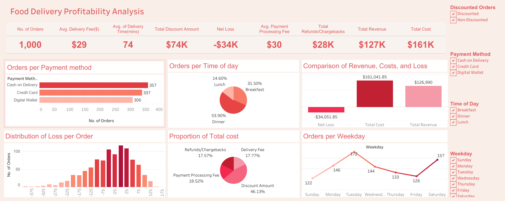

# delivery_orders_profitability
This project analyzes food order data to uncover insights regarding profitability, delivery efficiency, payment methods, and discount trends, identify areas for optimization, and simulate the effects of proposed changes.

## Project Overview
The dataset contains information about food delivery orders, including order value, discounts, commissions, delivery times, payment methods, and customer/restaurant identifiers. This project aims to:
- Clean and process the data.
- Perform exploratory data analysis (EDA) to uncover trends and key metrics.
- Assess the financial impact of current business strategies.
- Simulate the potential effects of changing discounts and commissions on profitability.
- Visualize the findings to support actionable strategies for enhancing profitability.

## Project Objective
The goal of the project is to identify trends in current business strategies and provide actionable insights for improving profitability based on the data analysis.

## Technologies utilized
- Pandas
- Matplotlib
- Seaborn
- Regex

## Methods Used
- Data Cleaning and Preprocessing
- Feature Engineering
- Exploratory Data Analysis
- Profitability Analysis
- Impact Simulation of Proposed Strategies
  
## Key Findings
- The time of day with the highest orders was in the evenings i.e at Dinnertime
- The most common payment method was Cash on Delivery. It also had the highest processing fee.
- The average delivery time was 73 minutes ( 1 hour and 13 minutes).
- The total cost exceeded the revenue generated resulting in a net loss. Discounts and Offers constitute a significant portion of the total cost.
- The average commission percentage for profitable orders is significantly higher than the overall average across all orders. This suggests that a higher commission rate on all orders might lead to increase in net profit. The reverse is the case for discount percentage.
- The recommended adjustments could lead to a higher proportion of profitable orders and net profit.
- A larger dataset is needed to gain insights on customers, restaurants and orders per month.

## Recommended Actionable Strategies
- Reducing the processing fee for cash on delivery or encouraging the use of digital wallets could lower overall transaction costs.
- Improving Delivery Times could reduce the cost associated with delayed deliveries, contributing to higher net profits.
- Adjusting discount policies to balance customer attraction with profitability. A targeted discount strategy (such as offering discounts during non-busy hours such as lunch time) might lead to better outcomes.
- Implementing higher commission rates, especially on high-value orders, could help boost revenue without affecting customer satisfaction.
